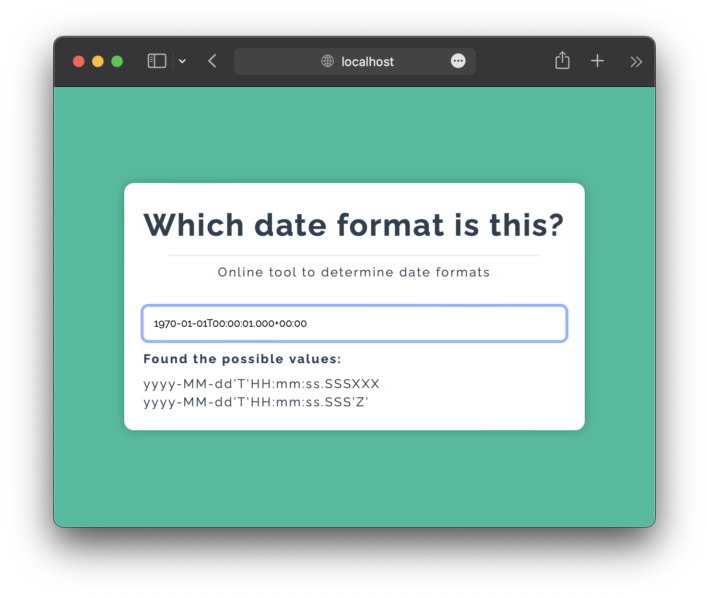

# Which date format is this?

Useful tool for determining the date format of a given string.

Take for example: `1970-01-01T00:00:01.000+00:00`

Simply pasting it on the input will run several formats against it and return the result.

	

		
	

	

		Results in these possible formats:
	

	

		
	

[Live demo here](https://leandrosq.github.io/which-dateformat/)

## Project

| Name | Description |
| -- | -- |
| Eslint | For linting and semantic analysis |
| Github actions | For CI, building and deploying to github pages |
| Gulp | For tooling and build manager |
| Babel | For transpiling ES6 code |
| Browserify | For bundling and compiling |
| [Oracle DateTimeFormatter](https://docs.oracle.com/javase/8/docs/api/java/time/format/DateTimeFormatter.html) | For date format specification |
| [Talend data preparation user guid](https://help.talend.com/r/en-US/8.0/data-preparation-user-guide/list-of-date-and-date-time-formats) | For formats and examples |
| [FontAwesome](https://fontawesome.com/) | For icons |